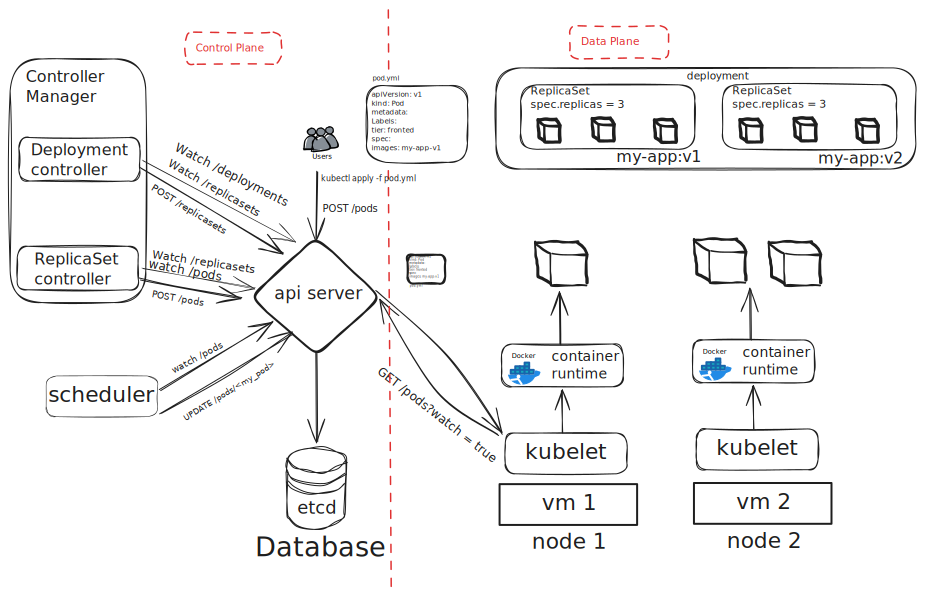

# kubernetes basics

- **kubernetes**: It is a container orchestration technology used to orchestrate
  the deployment and management of 100s and 1000s of containers in a clustered
  envrionment.

- **image**: An image is a package or a template that is used to create
  contianers.

- **containers**: A completly isolated environment that can have thier own
  proccess, network, mounts, etc but they share the same OS kernel. They are
  running instances of images.

- **Pods**: A pod is single instance of an application. It is smallest object
  you can create in kubernetes. A container is encapsulated in to a kubernetes
  object known as pods.

> [!NOTE] A pod can have multiple containers.  
> These containers are usually not of the same kind.

- **cluster**: A cluster is a set of nodes grouped together.

- **nodes(minions)**: A node is a machine physical or virtual on which
  kubernetes is installed. It is a worker machine where contianers will be
  launched.

- **master node**: A master node is another node in the cluster with kubernetes
  installed. It watches over the other nodes in the cluster and is responsible
  for orchestration of the contianers on worker nodes.

## Kubernetes Architecture

When you install kubernetes on a system, the following components are installed:

- **API Server** -> REST API to interact with the kubernetes cluster.
- **etcd keystore** -> Distributed reliable key value store used to store all
  the data required to manage the cluster and ensure there are no conflicts
  between the masters.
- **scheduler** -> Responsible for distributing work or containers across
  multiple nodes.
- **controller** -> The brain behind orchestration and responsible for bringing
  up new containers in case a node or contianers goes down.
- **container runtime** -> Underlying software used to run containers (docker).
- **kubelet** -> Responsible for making sure that containers are running on the
  node expected.

How does a kubernetes runs pod?

1. We've some client (using _kubectl_) that run `kubectl apply -f pod.yml`
2. kubectl is sending a POST request to a endpoint in the API server.
3. The _API server_ will persist the file/document in etcd.
4. The API Server will then send the pod to any client(node) that has open watch
   mechanism(via _kubelet_).
5. The node will have a _container runtime_(docker) which will check if the pod
   is already running, if not it will create a new pod on the node.
6. There is a _scheduler_ which orchestrates the pods on the nodes. This
   scheduler has a watch mechanism for both pods and the nodes. It will watch
   for pods that don't have any node name specified and look for the right node
   to put it on as efficiently as possible.
7. Kubernetes bundles together controller process together as the _controller
   manager_.
   - The _replicaset controller_ will watch for replicasets and pods. It will
     query for the number of pods that corresponds to the replicasets, and it
     will issue the creation of these pods if not present already.
   - The _deployment controller_ will watch for deployments and replicasets. It
     wil query the replicasets and issue creation of replicasets if a new
     version is detected.



## YAML in kubernetes

```yml
apiVersion:
kind:

metadata:

spec:
```

| Kind       | Version |
| ---------- | ------- |
| Pod        | v1      |
| Service    | v1      |
| ReplicaSet | apps/v1 |
| Deployment | apps/v1 |

- Pods with YAML:

```yml
apiVerison: v1
kind: Pod
metadata:
  name: myapp-pod
  labels:
    app: myapp
    type: front-end
spec:
  cotainers:
    - name: nginx-container
      image: nginx
```

- Replication Controller with YAML:

```yml
apiVersion: v1
kind: ReplicationController
metadata:
  name: myapp-rc
  labels:
    app: myapp
    type: front-end
spec:
  template:
    metadata:
      name: myapp-pod
      labels:
        app: myapp
        type: front-end
      spec:
        contianers:
          - name: nginx-container
            iamge: nginx
```
